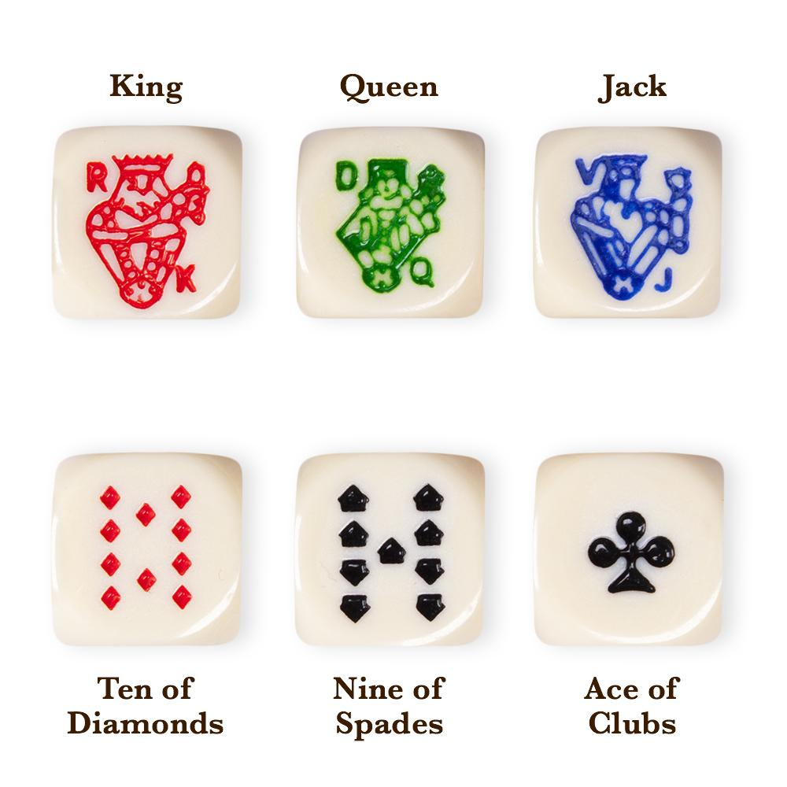

# GBC074-SD
Repositório para a matéria de Sistemas Distribuídos

# Descrição do Projeto:
A ideia é criar um Dice Poker, que é uma variação do jogo tradicional de Poker, com a diferença de que este é jogado com dados.

Quantidade de Jogadores: 2 ou mais.
O Dice Poker é jogado com 5 dados de 6 faces, numeradas de 1 a 6, onde cada face representa uma das 5 maiores cartas do poker (Da maior para a menor):
| Valor | Carta |
|-------|-------|
| 6     | A     |
| 5     | K     |
| 4     | Q     |
| 3     | J     |
| 2     | 10    |
| 1     | 9     |

O jogo terá até 3 rodadas por jogador, e as apostas são tomadas da mesma forma semelhante ao Poker Tradicional.
## Fases do Jogo:
1) Apostas: Inicialmente são recolhidas as apostas de todos os jogadores da mesa;
2) Para cada jogador:
   * Rodada 1: O jogador rola os cinco dados. Depois disso, decide se quer ou não continuar;
   * Rodada 2: O jogador rerrola de um a cinco dados, à sua escolha, dentre os que foram rolados anteriormente, juntando os valores obtidos com os que foram mantidos. Novamente decide se quer ou não continuar;
   * Rodada 3:  O jogador rerrola de um a cinco dados, à sua escolha, dentre os que foram rolados anteriormente, juntando os valores obtidos com os que foram mantidos. Agora não é possível continuar suas jogadas.
3) Resultado: Com as combinações finais obtidas para cada jogador, compara-se esses resultados entre si considerando os Ranks adaptados do Poker Tradicional;
   -> Observação: Caso haja empate entre vencedores novas rodadas são adicionadas para os vencedores até que um vencedor definitivo seja decidido.
5) Resolução das Apostas: O vencedor definitivo leva os valores acumulados das apostas.

## Ranks (Do maior para o menor):
1) Five of a Kind: Todos os 5 dados mostrando o mesmo valor;
2) Four of a Kind: 4 dos cinco dados mostrando o mesmo valor;
3) Full House: Um Pair de algum valor e um Three of a Kind de outro valor;
4) Straight: Sequência de 1 até 5 (1,2,3,4,5 ou 9,10,J,Q,K), ou de 2 até 6 (2,3,4,5,6 ou 10,J,Q,K,A), onde a segunda ganha da primeira;
5) Three of a Kind: 3 dos cinco dados mostrando o mesmo valor;
6) Two Pairs: Dois pares de dados, em que cada par possui o mesmo valor;
7) Pair: Dois dados mostrando o mesmo valor;
8) High Die: Os maiores dados são comparados, quem tiver o maior ganha, em empate considera o próximo dado, maior entre os restantes.

## Sobre os Módulos e a Arquitetura
Inicialmente, percebo 2 grandes módulos a serem construídos, o Servidor e o Cliente.
O Servidor ficará responsável por prover as salas de jogos para os usuários, e terá o controle dos valores apostados em cada mesa, além da ordem de jogo.
O Cliente é a interface que o usuário terá para jogar o jogo, que apresentará tanto os dados do jogador quanto os do restante da mesa. 
Além disso apresentará os valores apostados de cada jogo, e o dinheiro restante do próprio jogador

## Lista de Testes:
1) Teste de concorrência: Considerando que vários usuários estarão jogando ao mesmo tempo, será necessário alguma forma de controle de jogadas;
2) Teste de funcionalidades: Demonstrar o funcionamento do jogo em uma sala de jogo, vendo se todas as informações mostradas estão corretas, e se o jogo funciona como deveria;
